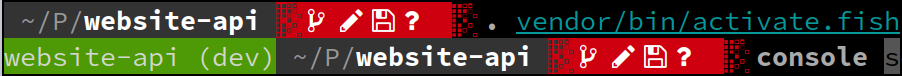

Highly inspired by the python virtualenv activate scripts.
Currently tested for bash, fish-shell and z-shell.



Installation
============

Make sure Composer is installed globally, as explained in the
[installation chapter](https://getcomposer.org/doc/00-intro.md)
of the Composer documentation.

Add it to your symfony application
----------------------------------------

### Step 1: Download the Library

Open a command console, enter your project directory and execute the
following command to download the latest stable version of this bundle:

```console
$ composer require sksymfony-venv
```

### Step 2: Activate virtual environment

In your project root dir run:

#### Bash / Z-Shell

```
$ . vendor/bin/activate
```

#### Fish shell

```
$ . vendor/bin/activate.fish
```
### Step 3: Use it

You are now able to call the `console` and other scripts located under your projects /bin
directory from everywhere. If you additionaly installed [symfony-console-autocomplete](https://github.com/bamarni/symfony-console-autocomplete)
globally the autocompletion for the console should work too.
 ```
(website-api) ~/P/website-api$ console <TAB><TAB>
about                                   debug:translation                       doctrine:mapping:import                 help                                    make:twig-extension
api:json-schema:generate                debug:twig                              doctrine:mapping:info                   lint:twig                               make:unit-test
api:openapi:export                      doctrine:cache:clear-collection-region  doctrine:migrations:diff                lint:xliff                              make:user
assets:install                          doctrine:cache:clear-entity-region      doctrine:migrations:dump-schema         lint:yaml                               make:validator
cache:clear                             doctrine:cache:clear-metadata           doctrine:migrations:execute             list                                    make:voter
cache:pool:clear                        doctrine:cache:clear-query              doctrine:migrations:generate            make:auth                               router:match
cache:pool:delete                       doctrine:cache:clear-query-region       doctrine:migrations:latest              make:command                            security:encode-password
cache:pool:list                         doctrine:cache:clear-result             doctrine:migrations:migrate             make:controller                         server:dump
cache:pool:prune                        doctrine:cache:contains                 doctrine:migrations:rollup              make:crud                               server:log
cache:warmup                            doctrine:cache:delete                   doctrine:migrations:status              make:entity                             server:run
config:dump-reference                   doctrine:cache:flush                    doctrine:migrations:up-to-date          make:fixtures                           server:start
debug:autowiring                        doctrine:cache:stats                    doctrine:migrations:version             make:form                               server:status
debug:config                            doctrine:database:create                doctrine:query:dql                      make:functional-test                    server:stop
debug:container                         doctrine:database:drop                  doctrine:query:sql                      make:migration                          swiftmailer:email:send
debug:event-dispatcher                  doctrine:database:import                doctrine:schema:create                  make:registration-form                  swiftmailer:spool:send
debug:form                              doctrine:ensure-production-settings     doctrine:schema:drop                    make:serializer:encoder                 translation:update
debug:router                            doctrine:generate:entities              doctrine:schema:update                  make:serializer:normalizer              
debug:swiftmailer                       doctrine:mapping:convert                doctrine:schema:validate                make:subscriber    
 ```

### Last Step: Deactivate virtual environment

To deactivate the virtual environment all you have to do is to deactivate it:

```
$ deactivate
```

Autocompletion for console
--------------------------

If [symfony-console-autocomplete](https://github.com/bamarni/symfony-console-autocomplete) is available in $PATH, the autocompletion
is generated automatically for the console.

*Caution*: If new commands are added to the console, they will not be recognized until the next activation.

# Contributing

When contributing to this repository, please first discuss the change you wish to make via issue,
email, or any other method with the owners of this repository before making a change. 

Please note we have a code of conduct, please follow it in all your interactions with the project.

## Pull Request Process

1. Ensure any install or build dependencies are removed before the end of the layer when doing a 
   build.
2. Update the README.md with details of changes to the interface, this includes new environment 
   variables, exposed ports, useful file locations and container parameters.
3. Increase the version numbers in any examples files and the README.md to the new version that this
   Pull Request would represent. The versioning scheme we use is [SemVer](http://semver.org/).
4. You may merge the Pull Request in once you have the sign-off of two other developers, or if you 
   do not have permission to do that, you may request the second reviewer to merge it for you.

## Code of Conduct

### Our Pledge

In the interest of fostering an open and welcoming environment, we as
contributors and maintainers pledge to making participation in our project and
our community a harassment-free experience for everyone, regardless of age, body
size, disability, ethnicity, gender identity and expression, level of experience,
nationality, personal appearance, race, religion, or sexual identity and
orientation.

### Our Standards

Examples of behavior that contributes to creating a positive environment
include:

* Using welcoming and inclusive language
* Being respectful of differing viewpoints and experiences
* Gracefully accepting constructive criticism
* Focusing on what is best for the community
* Showing empathy towards other community members

Examples of unacceptable behavior by participants include:

* The use of sexualized language or imagery and unwelcome sexual attention or
advances
* Trolling, insulting/derogatory comments, and personal or political attacks
* Public or private harassment
* Publishing others' private information, such as a physical or electronic
  address, without explicit permission
* Other conduct which could reasonably be considered inappropriate in a
  professional setting

### Our Responsibilities

Project maintainers are responsible for clarifying the standards of acceptable
behavior and are expected to take appropriate and fair corrective action in
response to any instances of unacceptable behavior.

Project maintainers have the right and responsibility to remove, edit, or
reject comments, commits, code, wiki edits, issues, and other contributions
that are not aligned to this Code of Conduct, or to ban temporarily or
permanently any contributor for other behaviors that they deem inappropriate,
threatening, offensive, or harmful.

### Scope

This Code of Conduct applies both within project spaces and in public spaces
when an individual is representing the project or its community. Examples of
representing a project or community include using an official project e-mail
address, posting via an official social media account, or acting as an appointed
representative at an online or offline event. Representation of a project may be
further defined and clarified by project maintainers.

### Enforcement

Instances of abusive, harassing, or otherwise unacceptable behavior may be
reported by contacting the project team at me@xbug.de. All
complaints will be reviewed and investigated and will result in a response that
is deemed necessary and appropriate to the circumstances. The project team is
obligated to maintain confidentiality with regard to the reporter of an incident.
Further details of specific enforcement policies may be posted separately.

Project maintainers who do not follow or enforce the Code of Conduct in good
faith may face temporary or permanent repercussions as determined by other
members of the project's leadership.

### Attribution

This Code of Conduct is adapted from the [Contributor Covenant][homepage], version 1.4,
available at [http://contributor-covenant.org/version/1/4][version]

[homepage]: http://contributor-covenant.org
[version]: http://contributor-covenant.org/version/1/4/

Licence MIT
===========

Copyright 2019 Sebastian Kroczek <me@xbug.de>

Permission is hereby granted, free of charge, to any person obtaining a copy of this software and associated documentation files (the "Software"), to deal in the Software without restriction, including without limitation the rights to use, copy, modify, merge, publish, distribute, sublicense, and/or sell copies of the Software, and to permit persons to whom the Software is furnished to do so, subject to the following conditions:

The above copyright notice and this permission notice shall be included in all copies or substantial portions of the Software.

THE SOFTWARE IS PROVIDED "AS IS", WITHOUT WARRANTY OF ANY KIND, EXPRESS OR IMPLIED, INCLUDING BUT NOT LIMITED TO THE WARRANTIES OF MERCHANTABILITY, FITNESS FOR A PARTICULAR PURPOSE AND NONINFRINGEMENT. IN NO EVENT SHALL THE AUTHORS OR COPYRIGHT HOLDERS BE LIABLE FOR ANY CLAIM, DAMAGES OR OTHER LIABILITY, WHETHER IN AN ACTION OF CONTRACT, TORT OR OTHERWISE, ARISING FROM, OUT OF OR IN CONNECTION WITH THE SOFTWARE OR THE USE OR OTHER DEALINGS IN THE SOFTWARE.

